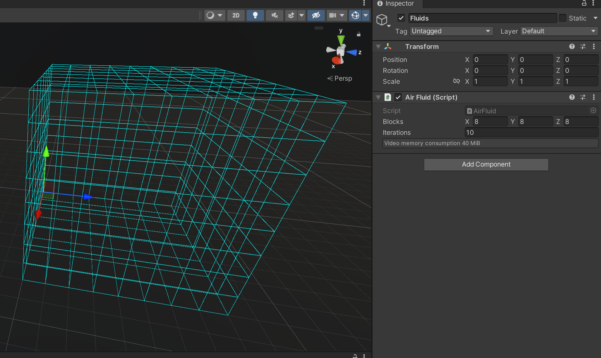
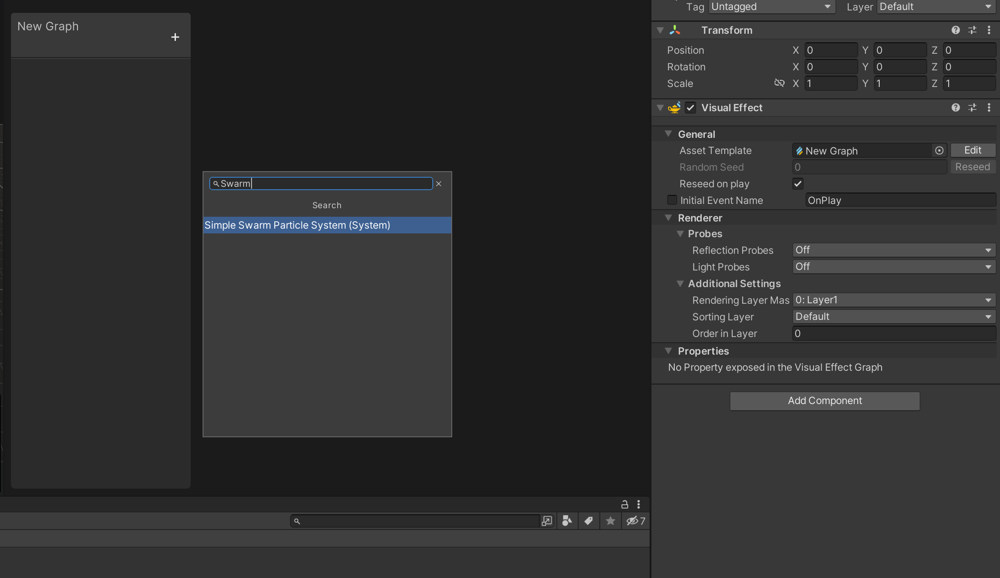
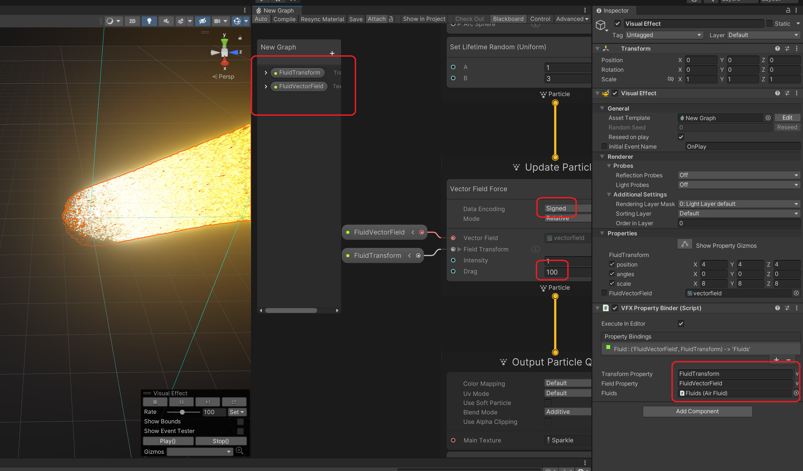
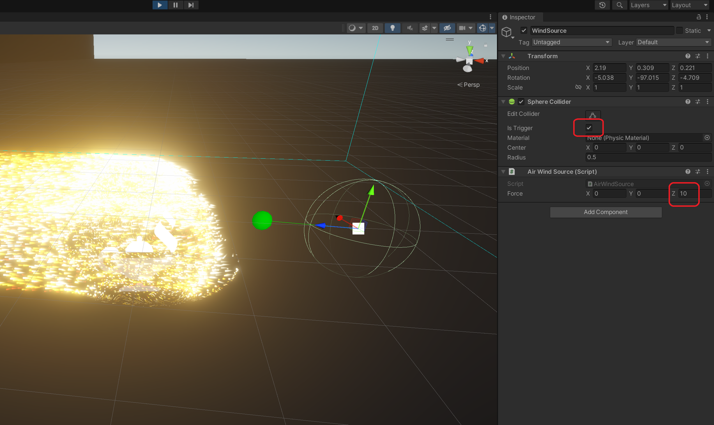
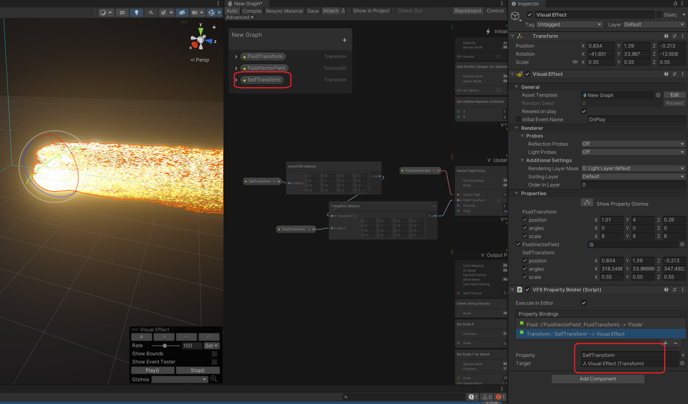
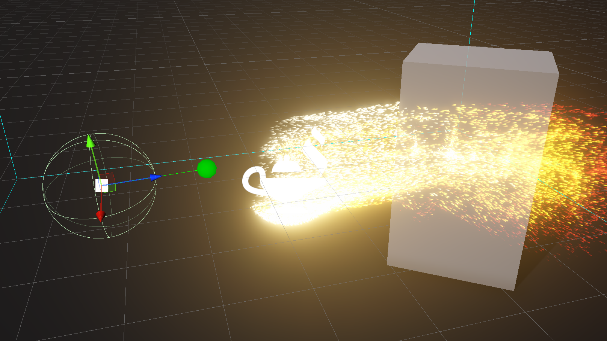

# AirFluid

AirFluid is a package for creating an interactive fluid simulation for Unity VFX Graph.

## Getting started

Создайте Empty Object и добавьте в него класс AirFluid. После этого можно настроить размер области симуляции (поле Blocks).

Create an Empty Object and add the AirFluid component to it. After that, you can change the size of the simulation area (the Blocks field).

Now let's create a new Visual Effect at the coordinate (0, 0, 0) (don't worry, then we'll show you how to allow moving effects). For example, use the template "simple swarm particle system".

Next remove the Turbulence block from the Update Particle, and add Vector Field Force instead, change the Data Encoding in it to Signed and increase Drag. Creating two variables of type Transform and Texture 3D, we will submit them to the input to Field Force. Let's add the AirFluidBinder component to the GameObject and set the values in it.

If we start the game now, we won't see anything, it's because there is no wind and the particles are stationary. Add another Empty Object to the scene, add a collider (for example SphereCollider) and an AirWindSource object to it. In the collider, will set the isTrigger flag, and in the AirWindSource will set some kind of Force value. Now you can start the game, and you can already blow the wind on the particles!

We can move the AirFluid object and everything will work, but if we move the particle system, it will still assume that the Transform of the simulation is set relative to it (while in fact it is set globally). Unfortunately, we have not found a more elegant way to solve this problem than to pass its own Transform to the VFX input, and do the following transformation.

Now you can just take any primitive colliders and everything will work.

