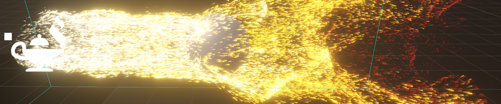

# AirFluid



AirFluid is a package for creating an interactive fluid simulation for Unity VFX Graph.

## Installation

It supports installation as a unity module via a git link in PackageManager or editing "Packages/manifest.json":

```JSON
    "ru.sid37.airfluid": "https://github.com/SID37/air-fluid.git"
```

By default, the latest release version is used. If you want to use a specific version, you can specify a tag or a branch name:

```JSON
    "ru.sid37.airfluid": "https://github.com/SID37/air-fluid.git#v-0.1.0"
```

## Learn

- [Getting started](Documentation~/AirFluid.md)
- [Technical reference](Documentation~/Reference.md)

## Magic


